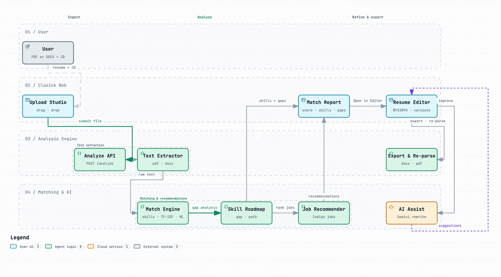

<div align="center">


<br><br>

## 🛠️ Tech Stack


<br><br>


</div>

<div align="center">

# Clasick

**Turn your resume into your competitive advantage.**

Resume analysis, skill-gap roadmaps, job matching, and an in-browser resume editor — powered by a trained ML model and an optional AI assistant.


[🚀 Live Demo](https://your-clasick-demo.example) · [⭐ Star on GitHub](https://github.com/77anuj77/job-prediction-ai-resume-analyser-fastapi) · [📖 Landing page](https://github.com/77anuj77/job-prediction-ai-resume-analyser-fastapi/blob/main/landing_page.md)


</div>

> **Note:** There is no public deployment yet — the Live Demo link is a placeholder. The app runs locally (see [Installation](#installation)).

---

## Preview

<div align="center">


</div>

---

## About

Clasick is a full-stack end-to-end resume analyzer. Upload a resume (PDF or DOCX) — optionally with a job description — and get a match score, matched/missing skills, a categorized skill-gap roadmap, and ranked job recommendations from a cleaned dataset of ~22k Indian job listings. A trained scikit-learn model blends skill overlap with TF-IDF text similarity into one score.

It also ships a full WYSIWYG resume editor with DOCX round-trip import/export and an optional LLM assistant for rewriting and improving your resume. Built for students and early-career job seekers who want concrete, actionable feedback instead of a vague "80% match".

## Features

- ⚡ **Instant analysis** — upload a PDF/DOCX, get a full report in seconds
- 🤖 **ML match scoring** — skill overlap + TF-IDF similarity + trained model prediction
- 🧭 **Skill-gap roadmap** — categorized `why` / `how` / `project` guidance per missing skill
- 💼 **Job recommendations** — ranked by recommendation score against a cleaned Indian job dataset
- ✍️ **In-browser resume editor** — Tiptap-based WYSIWYG with DOCX re-parse and export
- 🧠 **AI assistant** — OpenAI-compatible LLM (Gemini, OpenRouter, or OpenAI) for rewriting help
- 🛡️ **OCR fallback** — scanned PDFs are recovered with Tesseract + Poppler
- 📦 **One-container deploy** — multi-stage Dockerfile and GHCR CI/CD

## Tech Stack

#### Frontend

`Next.js 16` · `React 19` · `TypeScript` · `Tailwind CSS 4` · `TipTap` · `Framer Motion` · `Recharts`

#### Backend

`FastAPI` · `Python 3.12` · `Uvicorn` · `python-multipart`

#### ML & Data

`scikit-learn` · `pandas` · `NumPy` · `TF-IDF` · `PDFPlumber` · `pytesseract`

#### AI

`Gemini` · `OpenRouter` · `OpenAI` — anything OpenAI-compatible via `LLM_*` env vars

#### Infrastructure

`Docker` · `GitHub Actions` · `GHCR`

## Architecture

<div align="center">



</div>

> A current, spec-accurate board is also maintained as an interactive viewer in [`diagrams/`](diagrams/).

## How it works

```text
Upload resume → Extract text → Match & score → Roadmap + jobs → Report → Edit
```

1. **Upload** a text-based PDF or DOCX (`POST /analyze`), optionally pasting a job description.
2. **Extract** text via PDFPlumber (or OCR fallback for scans) / python-docx; skills are tagged against a ~37k-skill lookup.
3. **Match** resume skills against the JD skills, then blend TF-IDF cosine similarity and a trained model into one `final_match_score`.
4. **Derive** missing skills into a categorized learning roadmap with example projects.
5. **Recommend** the best-matching Indian job roles from the cleaned dataset.
6. **Refine** the resume in the editor — AI assist rewrites sections, and DOCX re-parse/export keeps the loop seamless.

## Installation

### Option A — Docker (recommended)

```bash
git clone https://github.com/77anuj77/job-prediction-ai-resume-analyser-fastapi.git
cd job-prediction-ai-resume-analyser-fastapi

cp .env.example .env   # optional: add an LLM key to enable AI assist

docker build -t clasick .
docker run --rm -p 8000:8000 -p 3111:3111 --env-file .env clasick:latest
```

Then open **http://localhost:3111**.

### Option B — Run locally

```bash
git clone https://github.com/77anuj77/job-prediction-ai-resume-analyser-fastapi.git
cd job-prediction-ai-resume-analyser-fastapi

# Backend
python3 -m venv venv
source venv/bin/activate
pip install -r requirements.txt
cp .env.example .env
uvicorn backend.main:app --host 127.0.0.1 --port 8000

# Frontend (in a second terminal)
cd web
npm ci
npm run dev        # http://localhost:3000
```

> **Note:** The OCR fallback needs system packages. On a bare machine install `poppler-utils` and `tesseract-ocr`; the Docker image already bundles them.

## Environment Variables

| Variable | Description | Required |
| --- | --- | --- |
| `LLM_API_KEY` | API key for the AI assistant (Gemini / OpenRouter / OpenAI) | No* |
| `LLM_BASE_URL` | OpenAI-compatible base URL (default: `https://api.openai.com/v1`) | No |
| `LLM_MODEL` | Model to use (default: `gpt-4o-mini`) | No |
| `OPENAI_API_KEY` | Legacy alias for `LLM_API_KEY` | No |

\* The core analyzer runs fully without any key; AI assist is simply disabled until one is set (`GET /ai/status` reports it).

## Usage

Analyze the sample resume right away:

```bash
curl -X POST http://127.0.0.1:8000/analyze \
  -F "resume_file=@data/sample/sample_resume.pdf" \
  -F "job_description=Data Scientist, Python, ML"
```

Useful endpoints:

| Endpoint | Purpose |
| --- | --- |
| `POST /analyze` | Resume (+ optional JD) → full analysis report |
| `POST /docx/parse` | Parse a DOCX into structured block content |
| `POST /docx/export` | Export edited content back to a `.docx` |
| `GET /ai/status` · `POST /ai/assist` | AI assistant availability + suggestions |

## Project Structure

```text
job-prediction-ai-resume-analyser-fastapi/
├── backend/          # FastAPI app: /analyze, /docx/*, /ai/*
├── src/              # Analysis pipeline: parser, matcher, recommender, ML
├── models/           # Trained sklearn artifacts (matcher + scaler)
├── data/             # Cleaned skill + Indian job datasets
├── web/              # Next.js 16 frontend (upload, report, editor, history)
├── assets/           # Demo GIFs and logo
├── diagrams/         # Interactive workflow diagram + animated GIF
├── Dockerfile        # Single-container backend + frontend build
├── requirements.txt
└── .github/workflows/ci.yml
```

## Roadmap

- [ ] Semantic (vector/BM25) search over the job dataset instead of scan + rank
- [ ] Persian-format resume layouts with direct PDF resume export from the editor
- [ ] Multi-region job recommendations beyond the current Indian dataset
- [ ] Retraining pipeline + model versioning for the match predictor
- [ ] Synced server-side history so reports follow the user across devices

## Contributing

Contributions, issues, and feature requests are all welcome.

1. Fork the repository
2. Create a feature branch — `git checkout -b feat/your-feature`
3. Make your changes and run `npm run lint` + `npx tsc --noEmit` (frontend) and `python -m py_compile backend/*.py src/*.py`
4. Open a pull request

## License

This repository currently has no explicit license. All rights reserved by the author until a license is added.

---

<div align="center">

**Built with ❤️ by [Anuj Paroha](https://github.com/77anuj77)**

[🚀 Live Demo](https://your-clasick-demo.example) · [⭐ GitHub](https://github.com/77anuj77/job-prediction-ai-resume-analyser-fastapi) · [🐛 Issues](https://github.com/77anuj77/job-prediction-ai-resume-analyser-fastapi/issues)

</div>
